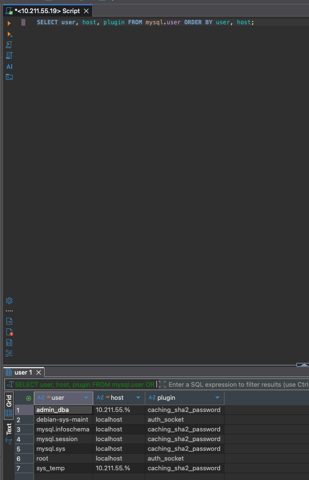
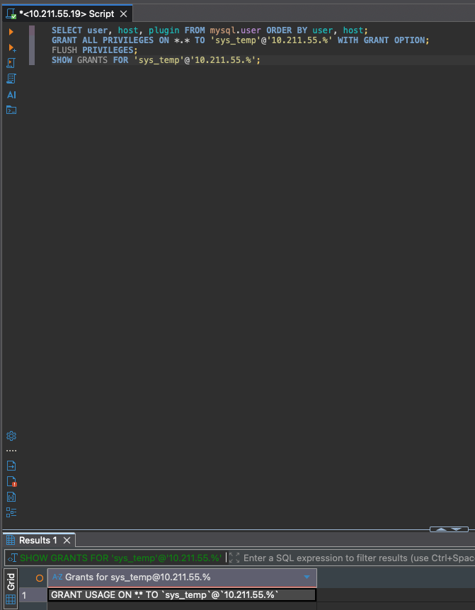
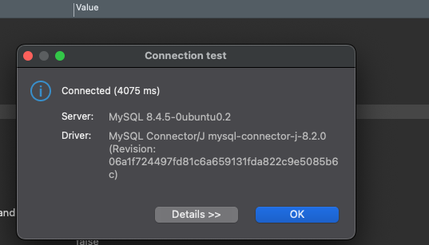
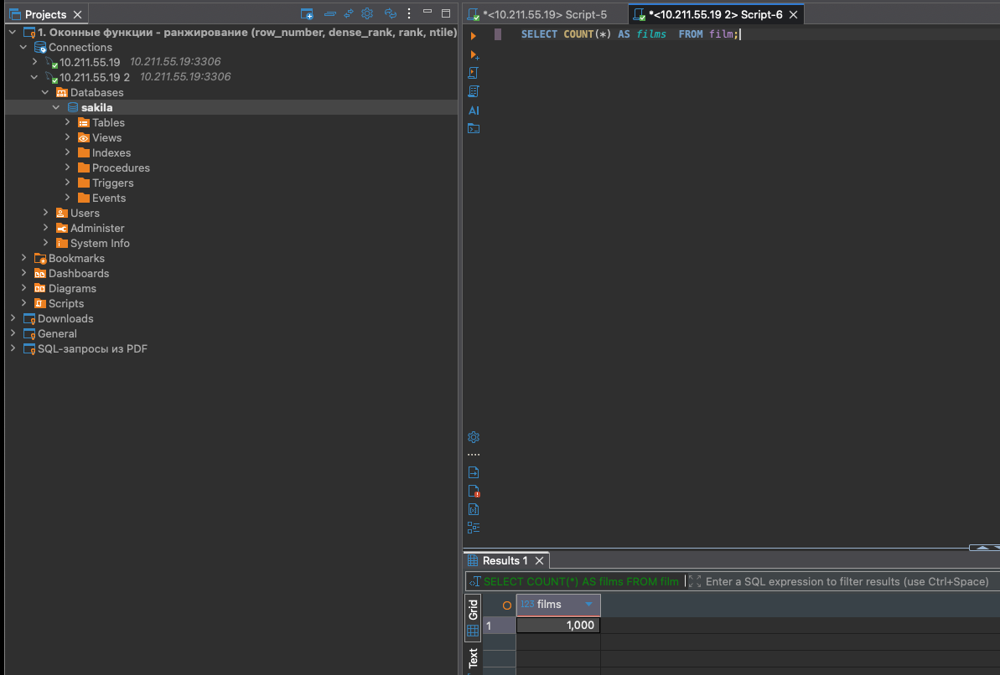
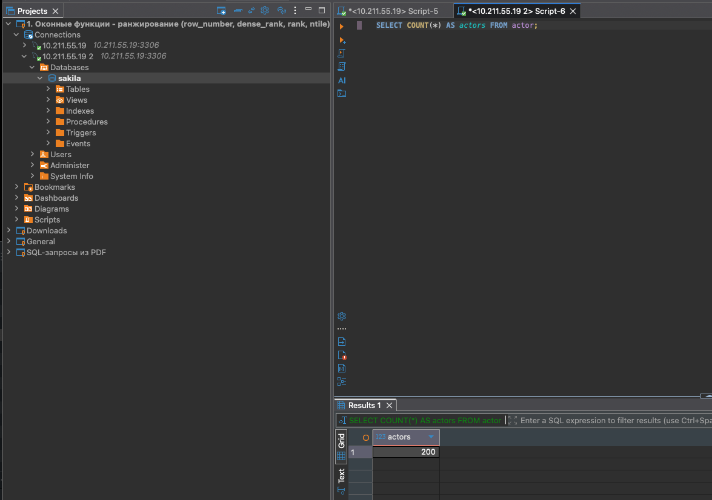
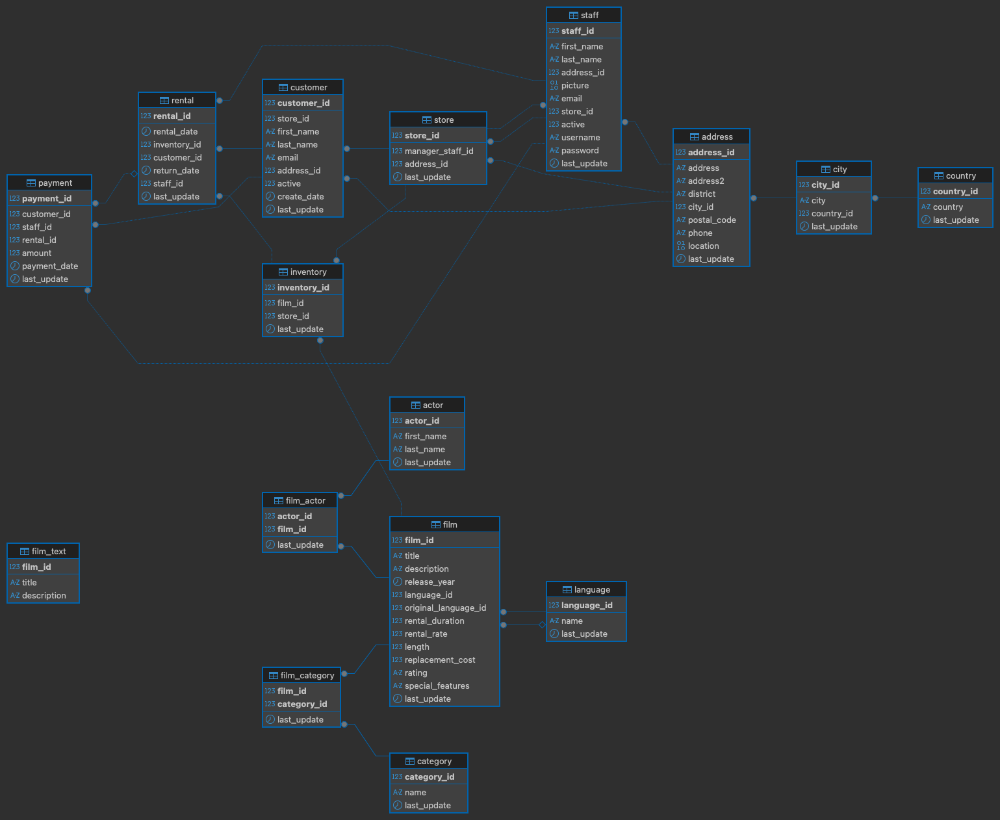

# Домашнее задание: Работа с данными (DDL/DML), MySQL 8

## Окружение
- Ubuntu (VM Parallels) + MySQL 8.4
- macOS + DBeaver
- Сеть: NAT, доступ с Mac разрешён

---

## Шаг 1 — установка, пользователи, права (пп. 1.1–1.6)

**Сделано:**
- Установлен MySQL 8; включён удалённый доступ (`bind-address = 0.0.0.0`).
- Создан админ `admin_dba@10.211.55.%`.
- Создан пользователь `sys_temp@10.211.55.%` (плагин: `caching_sha2_password`).
- Выданы права: `ALL PRIVILEGES ... WITH GRANT OPTION`.
- Подключение проверено через DBeaver.

**SQL (основное):**
sql
CREATE USER 'sys_temp'@'10.211.55.%'
  IDENTIFIED WITH caching_sha2_password BY '***';
GRANT ALL PRIVILEGES ON *.* TO 'sys_temp'@'10.211.55.%' WITH GRANT OPTION;
FLUSH PRIVILEGES;

- Проверки:

SHOW GRANTS FOR 'sys_temp'@'10.211.55.%';
SELECT user, host, plugin FROM mysql.user ORDER BY user, host;

**Скриншоты:**





---

## Шаг 2 — восстановление `sakila` и ER-диаграмма (пп. 1.6–1.8)

**Сделано:**
- Восстановлен дамп `sakila` через CLI (root через `sudo mysql`).
- Выданы права пользователю `sys_temp` на схему `sakila`.
- Проверена доступность таблиц и количества строк.
- Построена ER-диаграмма схемы `sakila` в DBeaver.

**Команды (CLI):**
```bash
sudo mysql < /tmp/sakila/sakila-db/sakila-schema.sql
sudo mysql < /tmp/sakila/sakila-db/sakila-data.sql
sudo mysql -e "GRANT ALL PRIVILEGES ON sakila.* TO 'sys_temp'@'10.211.55.%'; FLUSH PRIVILEGES;"
```

- Проверки (SQL):

USE sakila;
SHOW TABLES;
SELECT COUNT(*) AS films  FROM film;   -- 1000
SELECT COUNT(*) AS actors FROM actor;  -- 200

**Скриншоты:**




